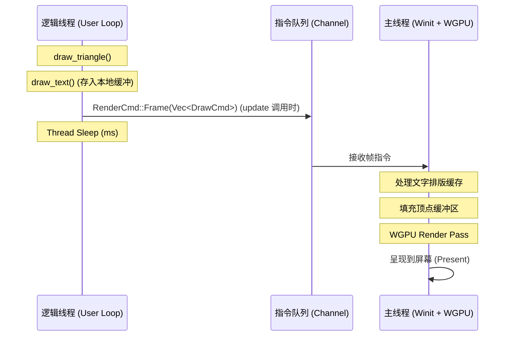

# 架构设计 (Architecture) - 最终版

## 核心理念
MyGRAPHICS 提供一种基于指令缓冲（Command Buffering）的伪即时模式图形接口。它通过将逻辑线程与渲染线程完全分离，解决了 `winit` 事件循环对代码结构的侵入性。

## 核心架构：三层结构

### 1. 用户 API 层 (Logic Thread)
- **批量提交 (Batching)**：用户调用的 `draw_*` 方法不再产生即时通信，而是将 `DrawCmd` 存入本地 `frame_buffer`。
- **显式同步**：只有在调用 `win.update(ms)` 时，本地缓冲才会被打包成一个 `RenderCmd::Frame` 统一发送给后端。这极大地降低了跨线程通信（Channel）的开销。

### 2. 编排层 (Orchestrator / Main Thread)
- **DPI 感知**：实时监控系统的 `Scale Factor` 变化，并将缩放因子同步给后端和输入系统。
- **输入平滑**：捕获物理像素位置并自动转换为逻辑像素位置，确保用户逻辑在不同分辨率屏幕下的一致性。

### 3. WGPU 渲染后端 (Backend)
- **智能排版缓存**：集成 `glyphon`，并通过 `HashMap` 缓存文字排版结果（Shaping）。只有当文字内容或颜色改变时才触发重排版。
- **批处理渲染**：将一帧内的所有三角形、线段分别打包进各自的顶点缓冲区，实现高效的 Draw Call。

## 线程同步模型

